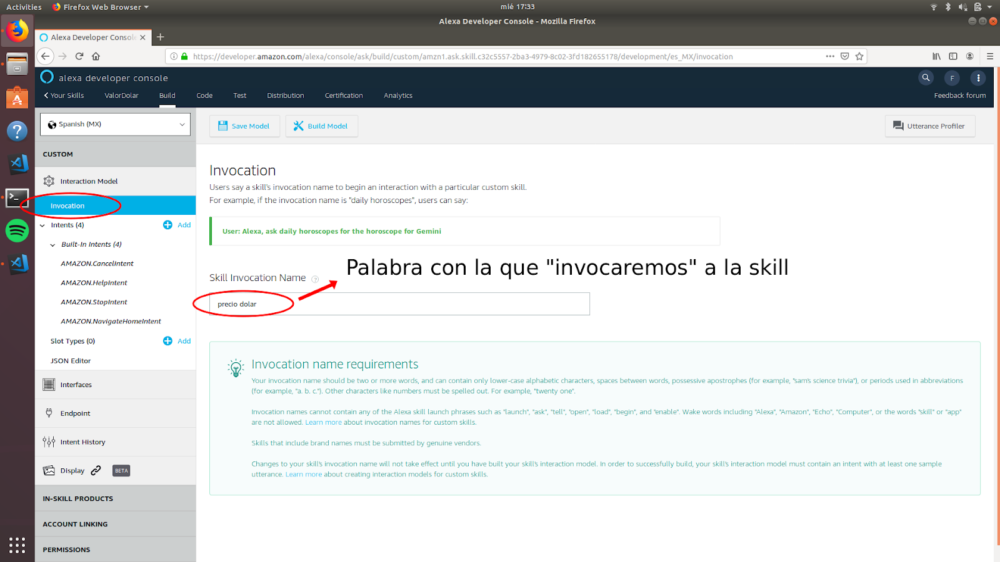

# Presentacion ANT: Desarrollo de Skills para Amazon Alexa
* Alumno: Facundo Barafani
* Docente: Javier Guignard
* Curso: 7 C

## Que vamos a hacer?
Se explicará la realización de una Skill la cual te devolverá el valor del dólar actualmente (el mismo traido de una API) una vez que es solicitado por el usuario.

## Requisitos:
* Editor de texto de preferencia.
* Cuenta de Amazon Developer
* Cuenta en currencyconverterapi.com (API utilizada para traer el valor del dolar actual)
* Acceso a internet para poder acceder a la Alexa Developer Console.
* **Aclaración:** No es necesario contar con un Amazon Echo para poder crear skills, las mismas se pueden probar desde la “Alexa Developer Console” o desde un simulador: echosim.io

## Que vamos a utilizar?
* NodeJS.
* SSML (Speech Synthesis Markup Language).
* AWS Lambda (Almacenamiento de la funcion).

## Que son las skills de Alexa?
Los skills de Alexa son básicamente funcionalidades extras creadas por terceras. Es el equivalente a las aplicaciones en un teléfono móvil.

**Las “skills” se pueden descargar en la tienda que tiene la aplicación de Amazon Alexa.**

## SSML, Que es?
SSML es un lenguaje utilizado para “formatear” la voz de un asistente virtual.

## Lambda, Que es?
AWS Lambda es un servicio que permite ejecutar código sin aprovisionar ni administrar servidores. AWS Lambda ejecuta el código sólo cuando es necesario, y se escala de manera automática.

**Aclaracion:** solo se paga el tiempo de computación que se consume.

## Breve explicacion antes de empezar con el tutorial
Para desarrollar skills de Alexa hay que tener en cuenta como funcionan,las mismas están definidas en requests, existen 3 tipos de requests:
* **LaunchRequest:** Se especificara que deberá realizar la skill cuando se abra. Ejemplo: Alexa, abre Precio Dólar.
* **IntentRequest:** Se especificara que realizara la skill cuando se solicite alguno de los intents que crearemos a continuación. Ej: Alexa, Cuál es el precio del dólar?
* **SessionEndedRequest:** Cuando se solicita cerrar la skill o algun error.

## Tutorial

### **Creacion de la Skill:**
1) Para empezar nos tenemos que dirigir a la conosola de desarrollo de Alexa: developer.amazon.com/alexa.

2)  Una vez que ya tengamos nuestra cuenta de desarrollador en Amazon nos saldra la lista de las skill que hayamos creados, en este caso ninguna entonces comenzaremos creando una:

3) Una vez estamos en la seccion de crear una skill tendremos que ingresar el nombre que deseemos para la skill, el idioma al que este skill respondera (se pueden crear skills para multiples idiomas) y en los otros seleccionaremos para comenzar de cero sin ninguna plantilla predeterminada.

4) Una vez creda la skill tendremos que definir la palabra con la queremos que se invoque la aplicacion, en el caso de la imagen "precio dolar". Es decir, que cada vez que digamos "Alexa, precio dolar" se ejecutara el script establecido en la skill.

5) El intent seria la accion predeterminada que tendra la app, en esta seccion se le define el nombre con el que lo llamaremos luego en el script.

6) Aca es donde asignaremos las palabras a las que respondera nuestra skill cuando sea invocado, es decir que cuando digamos "Cual es el precio del dolar" se va a ejecutar lo que hayamos definido en dicho "Intent".

7) Ahora nos dirigiremos a la consola de Lambda (console.aws.amazon.com/lambda)para almacenar la funcion que se ejecutara en la skill. Para tener acceso a la consola de Lambda es necesario tambien una cuenta de Developer de Amazon.

8) En la seccion de crear una funcion establecemos el nombre de la funcion y en que lenguaje se va a ejecutar, en este caso en NodeJS.

9) Ahora es cuando la tenemos que vincular con nuestra skill de amazon, esto lo vamos a encontrar en la lista de skills dentro de la Alexa Developer Console debajo del nombre donde dice "View Skill ID".

10) Al id de la skill la ingresamos a continuacion:

11) Tendremos que hacer lo mismo con la funcion de lambda, copiaremos el ARN para ser vinculado con el skill de Amazon.

12) En esta seccion es donde ingresaremos el script que sera ejecutado al ser llamado por el Intent de nuestra skill:

13) Para vincularlo con el skill de Alexa nos dirigiremos nuevamente a la Alexa Developer Console a la seccion llamada "Endpoint" y en el campo de texto pegaremos el id de ARN que copiamos previamente.

**No se olviden de Guardar los endpoints**

### **Desarollo del script que se ejecutara:**

Aca es donde se pondra en uso lo explicado anteriormente, la variable request es el json que recibe con el request de la skill, aca es donde entran en juego los Intents, como se explico anteriormente existen 3 tipos de requests:
* LaunchRequest
* IntentRequest
* SessionEndedRequest

1) Aca es donde especificamos que es lo que hara la skill, speechText se refiere a que es lo que va a responder el asistente virtual cuando reciba un request.

2) Un repromptText es lo que respondera el asistente virtual en caso de que el usuario no haya respondido o la respuesta haya sido erronea.

3) Endsession se refiere a cuando la skill finaliza, en caso del LaunchRequest queremos que sea false asi no finaliza el skill.

4) IntentRequest se refiere al Intent que creamos anteriormente en la Alexa Skill Developer Console, la cual correra el siguiente script cuando escuche alguna de las palabras que establecimos anteriormente.
Aca es donde utilizaremos la funcion para convertir la moneda de dolar a peso utilizando la API especificada anteriormente en los requisitos.

Procederemos a crear la funcion que creae la respuesta para ser enviada nuevamente al aparato y sea reproducida al usuario en cuestion.
Aca es donde utilizaremos SSML el cual sirve para "formatear" la voz del asistente virtual, podremos agregar pausas, especificar la acentuacion, etc.
En este caso al ser una respuesta simple no es necesario un formateo complejo.

Como ultimo paso crearemos la funcion para convertir de dolar a peso para luego ser reproducido al usuario, para esto utilizaremos la API mencionada anteriormente, la cual requiere registro para solicitar una key para ser utilizada.

Es un simple fetch para traer de la API la conversion de la moneda la cual se actualiza cada 30 minutos.

